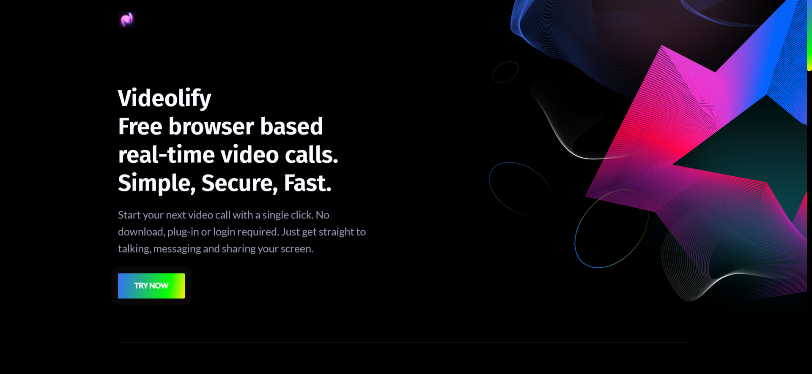

# Videolify

🚀 `A free WebRTC browser-based video call, chat and screen sharing` 🚀

<br>

[//]: https://img.shields.io/badge/<LABEL>-<MESSAGE>-<COLOR>

[](https://www.github.com/Jaideep25/Videolify/)

[](https://github.com/Jaideep25/videolify)
[](https://github.com/prettier/prettier) [](https://gitter.im/Videolify/community?utm_source=badge&utm_medium=badge&utm_campaign=pr-badge&utm_content=badge)

Powered by `WebRTC` using google Stun and [numb](http://numb.viagenie.ca/) Turn. `Videolify` provides video quality and latency not available with traditional technology.

Open the app in one of following **supported browser**

[//]: #

[](https://videolify.up.railway.app/)

## https://videolify.herokuapp.com/

<br>

[](https://videolify.herokuapp.com/)

## Features

- Is `100% Free` and `Open Source`
- No download, plug-in or login required, entirely browser based
- Unlimited number of conference rooms without call time limitation
- Desktop and Mobile compatible
- Optimized Room Url Sharing (share it to your participants, wait them to join)
- WebCam Streaming (Front - Rear for mobile)
- Audio Streaming
- Screen Sharing to present documents, slides, and more...
- File Sharing, share any files to your participants in the room
- Select Audio Input - Output && Video source
- Recording your Screen, Audio and Video
- Chat with Emoji Picker & Private messages & Save the conversations
- Simple Whiteboard for the teachers
- Share any YouTube video in real time
- Full Screen Mode on mouse click on the Video element
- Possibility to Change UI Themes
- Right click on the Video elements for more options
- Direct `peer-to-peer` connection ensures lowest latency thanks to `webrtc`
- Supports `API` (Application Programming Interface)

## Demo

- `Open` https://videolify.herokuapp.com/newcall `or` https://videolify.up.railway.app/newcall
- `Pick` your personal Room name and `Join To Room`
- `Allow` to use the camera and microphone
- `Share` the Room URL and `Wait` someone to join for video conference

## Room name

- You can also `join` directly to your room name by going to https://videolify.herokuapp.com/join/your-room-name-goes-here `or` https://videolify.up.railway.app/join/your-room-name-goes-here

## Quick start

- You will need to have [Node.js](https://nodejs.org/en/blog/release/v12.22.1/) installed, this project has been tested with Node version 12.X
- Clone this repo

```bash
git clone https://github.com/Jaideep25/videolify.git
cd videolify
```

## Setup Turn and Ngrok

- Copy .env.template to .env

```bash
cp .env.template .env
```

`Turn`

Not mandatory but recommended.

- Create an account on http://numb.viagenie.ca
- Get your Account USERNAME and PASSWORD
- Fill in your credentials in the `.env` file
- Set `TURN_ENABLED=true`, if you want enable the Turn Server.

`Ngrok`

Not mandatory at all, but useful for tests and debug.

- Get started for free https://ngrok.com/
- Fill in your authtoken in the `.env` file
- Set `NGROK_ENABLED=true`, if you want to expose the server using the https tunnel, starting it from your local PC.

## Install dependencies

```js
npm install
```

## Start the server

```js
npm start
```

- Open http://localhost:3000 in browser

---

## Docker

Install: https://docs.docker.com/compose/install/

```bash
cp .env.template .env
docker-compose up # or
docker-compose up -d
```

- Open http://localhost:3000 in browser

To `Update` image after some videolify `changes` or `updates`.

```bash
docker-compose build
```

To `Stops` containers and removes containers, networks, volumes, and images created by `up`

```bash
docker-compose down
```

## API

The `response` will give you a `entrypoint / Room URL` for `your meeting`, where `authorization: API_KEY_SECRET`.

```bash
curl -X POST "http://localhost:3000/api/v1/meeting" -H "authorization: videolify_default_secret" -H "Content-Type: application/json"
curl -X POST "https://videolify.up.railway.app/api/v1/meeting" -H "authorization: videolify_default_secret" -H "Content-Type: application/json"
curl -X POST "https://videolify.herokuapp.com/api/v1/meeting" -H "authorization: videolify_default_secret" -H "Content-Type: application/json"
```

## API Documentation

The server exposes a [swagger](https://swagger.io/) document at http://localhost:3000/api/v1/docs. Or you can check it out live on [railway](https://videolify.up.railway.app/api/v1/docs) or [heroku](https://videolify.herokuapp.com/api/v1/docs).

---

If you want to use a client on another computer/network, make sure you publish your server on an `HTTPS` connection.
You can use a service like [ngrok](https://ngrok.com/) or deploy it on:

<br>

[](https://www.heroku.com/)

`DEMO` https://videolify.herokuapp.com/

<br>

[](https://railway.app)

`DEMO :` https://videolify.up.railway.app/

---

## Credits

- Special thanks to Miroslav Pejic!

From where I took inspiration for this project. ❤️

## Contributing

- Pull Requests are welcome! :slightly_smiling_face:
- Please run [prettier](https://prettier.io) on all of your PRs before submitting, this can be done with `prettier --write videolify/`

---

<p align="center"> Made with ❤️ by <a href="https://www.github.com/Jaideep25/">Jaideep25</a></p>
